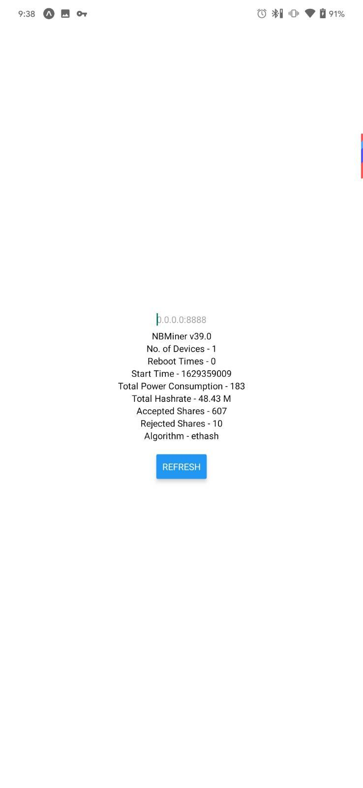
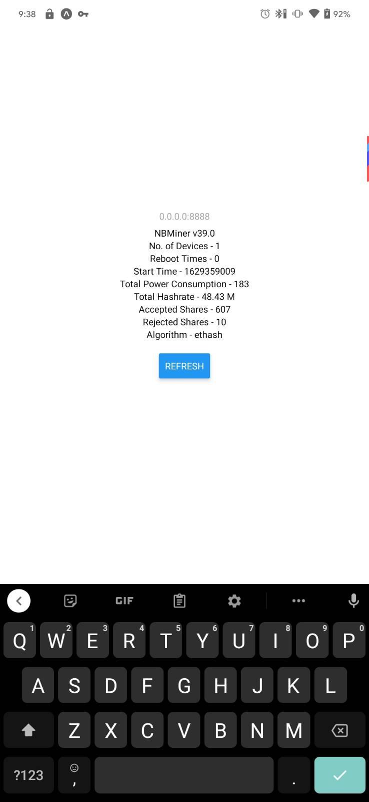

```
In Early Stage of Development | Terrible UI | No UX
```

# nbminer-monitor
A React Native App (for iOS and Android) to interact with the NBMiner API.
Monitor Temperatures, Power Consumption, Hashrate for NBMiner from an Android/iOS/.. App.

---

# Screenshots



